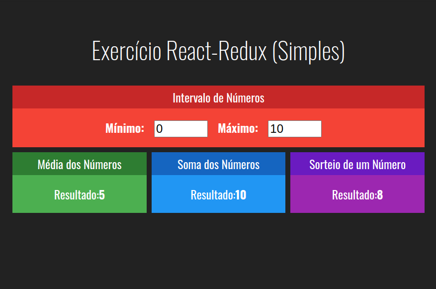

# Conhecendo Redux

Embora a simplicidade deste projeto não justifique inicialmente o uso de Redux, dado que todo o controle de estado pode ser facilmente obtido com o uso de `useState`, nosso objetivo é utilizá-lo para demonstrar como implementar e entender o uso do [Redux](https://react-redux.js.org/) para o controle de estado em uma aplicação React.

## Um pouco sobre Redux

#### Fonte: [www.treinaweb.com.br > Marylene Guedes > O que é Redux](https://www.treinaweb.com.br/blog/o-que-e-redux#:~:text=Reducers%3A%20Cada%20dado%20da%20store,foi%20enviada%20para%20o%20store.)

Basicamente o Redux tira a responsabilidade de cada um dos componentes de armazenar os estados, deixando tudo isso centralizado, sendo utilizado ao mesmo tempo por todos os componentes de forma compartilhada. Ele também roda em diferentes ambientes como servidor, cliente e nativo.

Fazendo uso do Redux todos esses estados ficam armazenados em uma árvore de objetos através do store. Para que isso aconteça, o Redux utiliza 3 recursos:

- __Store__ 
    - Você pode pensar em store como um container ou um grande centro de informações, que tem disponibilidade para receber e entregar o que o seu componente requisita. A store armazena de forma centralizada todos os estados da aplicação. Vale ressaltar que a store é imutável.

- __Actions__ 
    - São ações disparadas da aplicação para o store. Elas são criadas através das action creators. As actions são a única forma de acionar uma mudança de estados no store.

- __Reducers__
    -  Cada dado da store deve ter o seu próprio reducer. Ele é encarregado de lidar com todas as ações e especificam como o estado da aplicação irá mudar de acordo com a action que foi enviada para o store.


Vejamos a seguir um exemplo de como isso funciona.

### Temos um componente que precisa exibir e atualizar valores de estado na tela:

```javascript
    import React from 'react'
    import { connect } from 'react-redux'

    function MeuComponente(props) {
        const { variavelEstado1, variavelEstadoN } = props

        return (
            <div>
                <input type="number" 
                    value={ variavelEstado1 }
                    onChange={ e => props.alteracao1(+e.target.value) }
                />
            </div>
        )
    }

    // mapeia state para o objeto props
    function mapStateToProps(state) {
        const result = { 
            variavelEstado1: state.numeros.variavelEstado1,
            variavelEstado2: state.numeros.variavelEstadoN,
        }

        return result
    }

    // mapeia alteracao1, alteracaoN para o objeto props
    function mapDispatchToProps(dispatch) {
        const result = {
            alteracao1(novoNumero) {
                dispatch( alterarVariavelEstado1(novoNumero) )
            },
            alteracaoN(novoNumero) {
                dispatch( alterarVariavelEstadoN(novoNumero) )
            }
        }
    }

    // passa o objeto props para MeuComponente e exporta-o
    export default connect(
        mapStateToProps, 
        mapDispatchToProps
    )(MeuComponente)
```

A função connect é um [Decorator](https://blog.lsantos.dev/javascript-decorators/) _(design pattern)_ e decora a função do Componente _(MeuComponente)_ de modo que esta receba os valores de estado e as respectivas funções de mudança de estado.


### Temos a configuração dos _reducers_ e a criação do _Redux Store_

```javascript
    import { legacy_createStore as createStore, combineReducers } from 'redux'
    import meuReducer from './reducers/meuReducer'

    const reducers = combineReducers({
        numeros: meuReducer,
    })

    export default function storeConfig() {
        return createStore(reducers)
    }
```

Observe que está sendo exportada a função _storeConfig_ que é chamada no _index.js_ da raiz do projeto a fim de criar a _Redux Store_ que será compartilhada com a árvore de componentes da aplicação. Neste arquivo também estão sendo definidos os _n reducers_ responsáveis por manter os diferentes estados da aplicação.

Veja a seguir a codificação de `meuReducer`:

```javascript

    // valores iniciais de state
    const initialState = {
        variavelEstado1: 10,
        variavelEstadoN: 100
    }

    export default function numeros(state = initialState, action) {

        switch( action.type ) {

            // se for a action VAR1_ALTERADA
            case 'VAR1_ALTERADA':
                return { ...state, variavelEstado1: action.payload }
            
            // se for a action VARN_ALTERADA
            case 'VARN_ALTERADA':
                return { ...state, variavelEstadoN: action.payload }
            
            // senão devolve state original
            default:
                return state

        }

    }

```

Quando a aplicação é carregada os _reducers_ são executados para iniciar o _state_ e com isso os valores de _initialState_ são atribuídos. A fim de atualizar os valores de _state_, são definidas as _actions_ que uma vez acionadas, executam também os _reducers_ passando o nome da _action_ em execução.

Veja a seguir o código das funções _Action Creator_ responsáveis por criar as actions:

```javascript

    export function alterarVariavelEstado1(novoNumero) {
        return {
            type: 'VAR1_ALTERADA',  // action VAR1_ALTERADA
            payload: novoNumero
        }
    }

    export function alterarVariavelEstadoN(novoNumero) {
        return {
            type: 'VARN_ALTERADA',  // action VARN_ALTERADA
            payload: novoNumero
        }
    }

```

> __Nota:__ Veja mais acima no componente `MeuComponente`, função _mapDispatchToProps_,
> como estas _Action Creators_ são invocadas.

## A aplicação no navegador

#### Aplicação desenvolvida durante o curso [React + Redux :: Leonardo Leitão](https://www.udemy.com/course/react-redux-pt)



## Criação do projeto

No terminal de comandos execute os passos abaixo:

```bash

# inicia um novo projeto
$ npx create-react-app redux-simples

# entra no diretório do projeto
cd redux-simples

# instala dependências Redux
npm install redux@^4.0.5 react-redux@^7.2.0

```

## Primeira Implementação

Nesta primeira etapa, no desenvolvimento sem Redux, utilizamos o estado local _(useState)_ do componente App para compartilhar valores entre os componentes filhos, como [Media](./src/components/without_redux/Media.jsx), [Soma](./src/components/without_redux/Soma.jsx), [Sorteio](./src/components/without_redux/Sorteio.jsx) e [Intervalo](./src/components/without_redux/Intervalo.jsx). Isso foi alcançado através de [comunicação direta](https://douglasabnovato.medium.com/comunica%C3%A7%C3%A3o-entre-componentes-em-reactjs-27a89c38f33a), onde os valores e as funções de mudança de estado foram passados como props para os componentes filho, como o Intervalo. Essa abordagem permitiu que os estados fossem atualizados indiretamente a partir de componentes de Input na interface do navegador.

> Os arquivos [App.js](./src/without_redux/App.js), [App.css](./src/without_redux/App.css), [index.js](./src/without_redux/index.js) e [index.css](./src/without_redux/index.css) deste estágio estão na página `without_redux`.


## Segunda Implementação

Nesta etapa estamos substituindo o controle baseado em estado local _(useState)_ no componente [App](./src/without_redux/App.js) pela [Redux Store](https://redux.js.org/tutorials/fundamentals/part-4-store).

As alterações seguem basicamente o que foi explicado no início deste README, ou seja:

- No [index.js](./src/index.js) vamos recuperar a Redux Store e compartilha-la com a árvore de componentes no [App.js](./src/App.js) através do componente [Provider](https://react-redux.js.org/api/provider) do React-Redux.

- Então o arquivo [storeConfig.js](./src/store/storeConfig.js) é responsável por configurar os diferentes reducers e retornar a Redux Store criada.

- Finalmente nos componentes [Intervalo.jsx](./src/components/with_redux/Intervalo.jsx), [Media.jsx](./src/components/with_redux/Media.jsx), [Soma.jsx](./src/components/with_redux/Soma.jsx) e [Sorteio.jsx](./src/components/with_redux/Sorteio.jsx) são definidas as funções `mapStateToProps` e `mapDispatchToProps` responsáveis por disponibilizar ao componente as variáveis estado bem como as funções de alteração de estados se necessário.


## Dica VSCode
Ao utilizar a extensão `Material Icon Theme` _(Philipp Kief)_, junto ao nome da extensão tem uma engrenagem que ao ser clicada dá acesso a um menu que oferece a opção `Configurações de Extensão`. 

Entre as configurações possíveis, a opção `Material-icon-theme > Folders > Associations` permite personalizar os ícones que são exibidos para os diferentes arquivos e pastas do projeto.

Para este projeto fiz a seguinte configuração:
```json
    ...
    "material-icon-theme.folders.associations": {
        "widgets": "components",
        "front-angular": "font",
        "front-react": "React-Components",
        "front-vue": "vue",
        "store": "Redux-store",
        "actions": "redux-actions",
        "reducers": "redux-reducer",
    },
    ...
```
